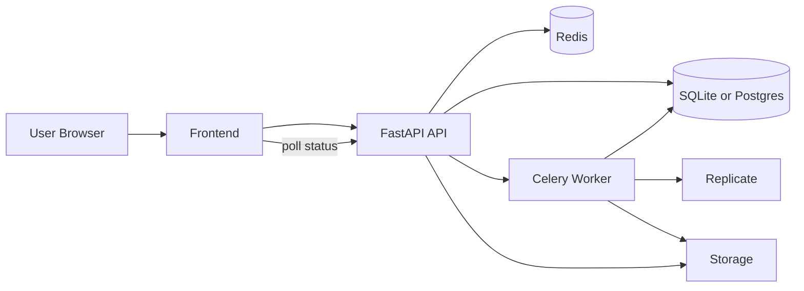

# StyleVid

StyleVid helps you create short AI videos in your own likeness.

Production website/API: https://stylevid-api.nicesand-10f28641.eastus.azurecontainerapps.io/

You can:

- Upload a selfie
- Upload training videos to improve likeness quality
- Train a one-time likeness model (optional)
- Generate and download videos

## For End Users

### How to Use

1. Create an account and log in.
2. Open Account settings and paste your Replicate API key.
3. Upload a clear selfie (single face, good lighting).
4. Optional: upload training videos and run LoRA training for better identity consistency.
5. Enter a prompt and generate.
6. Track progress in History and download when complete.

If training fails, verify your Replicate key and account balance, then retry.

### Before you start

You need:

- A Replicate account and API key (starts with `r8_`)
- A clear selfie photo (single face, good lighting)
- Optional training videos where your face is visible

### Important billing note

StyleVid itself does not charge you. Training and generation costs are billed directly by your Replicate account.

### Quick start

1. Open the app
2. Sign up and log in
3. Add your Replicate API key in Account
4. Upload your selfie
5. Optional: upload training videos and run training
6. Enter a prompt and click Generate
7. Download from History

### Best results tips

- Use a high-quality selfie with your full face visible
- Avoid sunglasses, masks, or heavy motion blur
- For training videos, use clips with stable lighting and frequent face visibility
- Start with short prompts and simple scenes, then iterate

### What each mode means

- Selfie mode: fastest path, no training required
- Training mode: uses frames/clips extracted from your uploaded videos
- LoRA mode: optional one-time training for best identity consistency

### Typical timing

- Frame extraction: around 2-5 minutes
- LoRA training: around 10-15 minutes
- Video generation: usually a few minutes, depends on queue/load

### Troubleshooting

- "Could not verify key": check that your Replicate key starts with `r8_` and is active
- "No face detected": upload a clearer selfie with one visible face
- Training failed: try different uploaded videos with clearer face coverage
- Empty/failed generation: retry once, then check job status in History

## For Developers

## Tech Stack

- Backend: FastAPI, SQLAlchemy, Pydantic
- Async workers: Celery + Redis
- AI video/training: Replicate APIs
- CV/media: OpenCV + ffmpeg
- Storage: Local filesystem or Azure Files
- Database: SQLite (local) / PostgreSQL (production)
- Infra: Docker + Azure Container Apps + Azure Cache for Redis + Azure Database for PostgreSQL
- Testing: pytest (unit + integration)

### What this project is

StyleVid is a full-stack AI video generation platform with async job orchestration and production hardening.

- FastAPI backend with JWT authentication
- Celery workers for long-running jobs
- Redis queue for async orchestration
- Replicate for video generation and LoRA training
- Security hardening for password reset, job ownership, and CORS
- Unit and integration tests

## Architecture



### Runtime components

- `backend/api/main.py`: FastAPI app and middleware
- `backend/api/routes/*`: HTTP routes for auth, pipeline, onboarding, and training
- `backend/workers/*`: Celery tasks for generation and training
- `backend/services/*`: Replicate, storage, face swap, and media utilities
- `backend/db/*`: ORM models and CRUD

## Security

- Passwords hashed with bcrypt
- Reset tokens hashed before storage
- Constant-time reset token verification
- Replicate API keys encrypted at rest
- Sensitive keys not passed through queue payloads
- Ownership checks on async job status endpoints
- Configurable restricted CORS
- File-serving path traversal protections

## Local setup

1. Copy env template:

```bash
cp .env.example .env
```

2. Start services:

```bash
uvicorn backend.api.main:app --reload --port 8000
celery -A backend.workers.celery_app:celery_app worker --loglevel=info -Q generation -c 2
```

3. Run tests:

```bash
pytest -q
```

## Deployment (Azure)

Recommended baseline:

- Azure Container Apps for API and worker
- Azure Cache for Redis
- Azure-generated domain for API/frontend
- Shared persistent storage for uploaded and generated media

Recommended if you want production-grade reliability:

- Azure Container Apps for API and worker
- Azure Cache for Redis
- Azure PostgreSQL Flexible Server
- Azure Files for uploads and generated videos
- Higher baseline cost, better resilience

Production checklist:

- Set `APP_ENV=production`
- Set strong `ENCRYPTION_KEY` and `JWT_SECRET`
- Set `CORS_ORIGINS` to your deployed Azure URL(s)
- Set `DATABASE_URL` for Postgres if using managed DB
- Mount shared persistent storage at `/tmp/stylevid2` for API and worker
- Configure SMTP if password-reset emails should be sent

### Deploy today (step by step)

1. Install prerequisites:

```bash
az version
docker --version
```

2. Log in and select subscription:

```bash
az login
az account set --subscription "<YOUR_SUBSCRIPTION_NAME_OR_ID>"
```

3. Set required deployment environment variables:

```bash
export AZURE_RG="stylevid-rg"
export AZURE_LOCATION="eastus"
export ACR_NAME="stylevidacr"
export APP_ENV_NAME="stylevid-env"
export REDIS_NAME="stylevid-redis"
export PG_SERVER_NAME="stylevid-pg"
export PG_DB_NAME="stylevid"
export PG_ADMIN_USER="stylevidadmin"
export STORAGE_ACCOUNT="stylevidstorage"
export FILE_SHARE_NAME="stylevid-files"

export ENCRYPTION_KEY="<STRONG_RANDOM_BASE64_KEY>"
export JWT_SECRET="<STRONG_RANDOM_HEX_SECRET>"
export PG_ADMIN_PASSWORD="<STRONG_DB_PASSWORD>"

# Optional for password reset emails
export SMTP_HOST="smtp.gmail.com"
export SMTP_PORT="587"
export SMTP_USER="you@gmail.com"
export SMTP_PASSWORD="<SMTP_APP_PASSWORD>"
export SMTP_FROM="you@gmail.com"
```

4. Build and push the container image:

```bash
az acr create --resource-group "$AZURE_RG" --name "$ACR_NAME" --sku Basic --admin-enabled true || true
az acr login --name "$ACR_NAME"
docker build -t "$ACR_NAME.azurecr.io/stylevid:latest" .
docker push "$ACR_NAME.azurecr.io/stylevid:latest"
```

5. Deploy infrastructure and apps:

```bash
chmod +x infra/deploy.sh
./infra/deploy.sh
```

6. Verify deployment:

```bash
API_FQDN=$(az containerapp show --name stylevid-api --resource-group "$AZURE_RG" --query "properties.configuration.ingress.fqdn" -o tsv)
curl -s "https://${API_FQDN}/health"
```

7. Open the app and test a full flow:

- Register and log in
- Save Replicate key
- Upload selfie
- Generate video
- Confirm output appears in History

### Reverse proxy and rate-limit note

Rate limiting uses forwarded client IP when available (`X-Forwarded-For`, then `X-Real-IP`). Azure ingress provides these headers, so limits are per user IP in production.

## Repository layout

- `backend/`: API, database, services, workers
- `frontend/`: static frontend
- `infra/`: deployment scripts
- `scripts/`: utility scripts
- `tests/`: unit and integration tests

